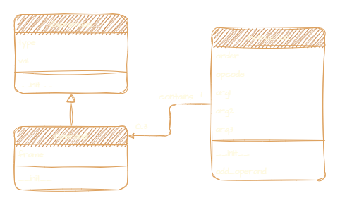

Documentation of Project Implementation for IPP 2022/2023\
Name and surname: Vadim Goncearenco\
Login: xgonce00

# Implementation description
The project implementation is divided into `six` modules:
* `base.py` - central module of the interpreter, holding functions that are commonly used by instructions (`instructions.py`)
* `instructions.py`- module with all the functions implementing instruction functionality, made to be as consise as possible with help of `base.py` functions.
* `classes.py` - holds all the classes implementation in the project.
* `error.py` - custom exception classes to avoid rasing general exceptions (`Exception`) which may lead to hiding bugs and internal errors.
* `globals.py` - module with global variables that are used in `base.py` and `instructions.py`. Separate module for globals provides uniform access to avoid accident redefinition and etc.
* `interpret.py` - project entry point that contains "main" function and command line arguments parsing.

Even though the biggest part of implementation is in global scope, separated in modules, the project still makes use of OOP principles available in Python3, thus there are `three` classes:
* `Expression` - a plain simple class that only has type and value attributes. Used as a record of variable in the corresponding frame and also as base class for `Operand` object.
* `Operand` - class that represent and encapsulates information that belongs to any instruction from source XML file.
    * `__init__` - at creation `Operand` object converts it's value according to `type` attribute. For example parses it's `text` string with `parse_string` function.
* `Instruction` - class hodling an `opcode` string with insctruction name, `order` and up to three arguments of `Operand` type.
    * `add_operand` - adds new argument, while catching or forwading possible exceptions.

Using more classes would gradually increase the amount of code and most likely make it less readable and more cumbersome.

